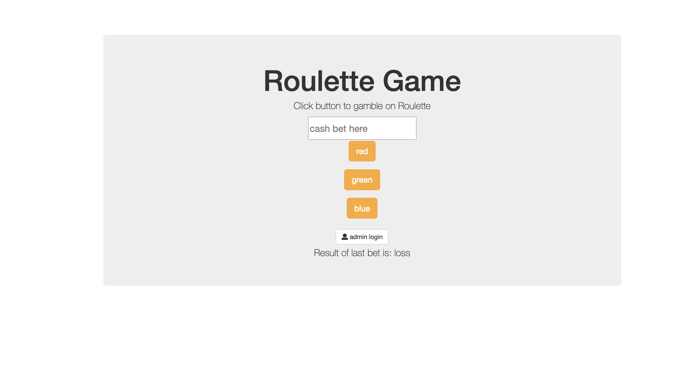

# Roulette
This project is a gambling game to use express and nodejs alongside a sign on authentication tool passport. users have a public facing site available to them where they can place a bet. The application will then show if the user has won or lost their previous bet. 

There is an admin portal for administrator to sign in to view total casino earnings and losses.

**Link to project:**

## How It's Made:

**Tech used:** HTML, Bootstrap, JavaScript ES6+, nodeJS, Express, mongoDB, Passport

This project is for working with CRUD application Express. When a user enters text in the input and presses submit this will trigger a get request. 

READ
-the get request reads and renders our main index page using EJS as our view engine. It provide the entire database collection to the response object and renders our main page view onto the DOM. what is rendered onto the page is filtered to only include the submissions of the current session. This is done by providing using the unique ID that mongo provides to each signed in session as a conditional filter using javascript in our ejs view.

POST
-the post request will save the user input into a database and trigger another get request.

PUT
-The put request will run when the icons are clicked. event listeners trigger a function that submit a fetch request to our declared routes for put requests. The routes use mongo provided functions findOne and update to modify the dom and returns a response to our function in the main.js folder. The promise in our fetch triggers a page reload.   

DELETE
-the delete request deletes the user input from  our database, returns a response to our function in our main.js folder, and the promise in our fetch triggers a page reload.  

## Optimizations

## Lessons Learned:

A great takeaway from this project is understanding the value of authentication. The password is stored in our database and then encrypted using passport. This means if the site is hacked it is significantly harder to reverse hash the password and obtain a clear text password from the user.

## Examples:
